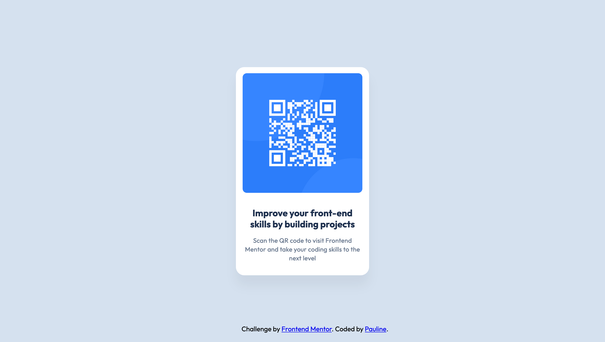

# Frontend Mentor - QR code component solution

This is a solution to the [QR code component challenge on Frontend Mentor](https://www.frontendmentor.io/challenges/qr-code-component-iux_sIO_H). Frontend Mentor challenges help you improve your coding skills by building realistic projects. 

## Table of contents

- [Overview](#overview)
  - [Screenshot](#screenshot)
  - [Links](#links)
- [My process](#my-process)
  - [Built with](#built-with)
  - [Continued development](#continued-development)
- [Author](#author)

## Overview

### Screenshot

### Links

- Solution URL: [Add solution URL here](https://your-solution-url.com)
- Live Site URL: [Add live site URL here](https://your-live-site-url.com)

## My process

### Built with

- Semantic HTML5 markup
- CSS custom properties
- Mobile-first workflow

### Continued development

I want to continue improving my skills in web development and found this great resource that emphasises learning through building hands-on projects. This first project was particularly useful for revising some concepts, while also familiarising myself with the platform. Moving forward, I'd focus more on improving responsiveness. 

## Author

- Frontend Mentor - [@pcamp44](https://www.frontendmentor.io/profile/pcamp44)
